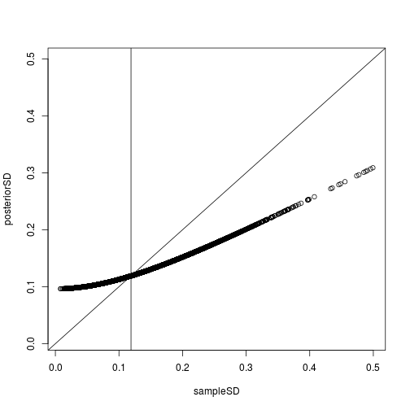
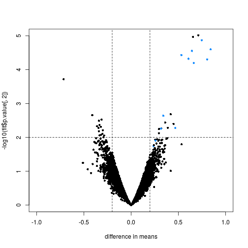

----
## Exercices and corrections for the [PH525.3x Statistical Inference and Modeling for High-throughput Experiments](https://www.edx.org/course/statistical-inference-modeling-high-harvardx-ph525-3x) edX MOOC.

----


# WEEK 1

## R Refresher Exercises
### R Refresher Exercises #1

Download and install the GSE5859Subset package then load the data.


```r
library(devtools)
```

```
##
## Attaching package: 'devtools'
```

```
## The following object is masked from 'package:rafalib':
##
##     install_bioc
```

```r
install_github("genomicsclass/GSE5859Subset")
```

```
## Skipping install of 'GSE5859Subset' from a github remote, the SHA1 (8ada5f4f) has not changed since last install.
##   Use `force = TRUE` to force installation
```

```r
library(GSE5859Subset)
data(GSE5859Subset) ##this loads the three tables
```


How many samples where processed on 2005-06-27?


```r
length(grep('2005-06-27', sampleInfo$date))
```

```
## [1] 5
```

### R Refresher Exercises #2

How many of the genes represented in this particular technology are on chromosome Y?


```r
length(which(geneAnnotation == "chrY"))
```

```
## [1] 21
```

### R Refresher Exercises #3

What is the log expression value of the for gene ARPC1A on the one subject that we measured on 2005-06-10?


```r
pid = geneAnnotation$PROBEID[which(geneAnnotation$SYMBOL== 'ARPC1A')]
samDate = sampleInfo$filename[(grep('2005-06-10', sampleInfo$date))]

geneExpression[pid,samDate]
```

```
## [1] 8.233599
```


### R Refresher Exercises #4

Use the function apply to find the median value of each column. What is the median value of these values?


```r
firstMed = apply(geneExpression, 2, median)
secMed = median(firstMed)
secMed
```

```
## [1] 5.421568
```

###  R Refresher Exercises #5

This problem is more advanced than the previous ones. Note that it might take you some time to solve and you should feel free to seek help in the discussion forum. The exercises is meant to motivate you to learn a an imporant R skills: creating functions to use with apply.

Write a function that takes a vector of values e and a binary vector group coding two groups, and returns the p-value from a t-test: t.test( e[group==1], e[group==0])$p.value.

Now define g to code cases (1) and controls (0) like this g <- factor(sampleInfo$group)

Next use the function apply to run a t-test for each row of geneExpression and obtain the p-value. What is smallest p-value among all these t-tests?


```r
tpval = function(e, group){
  group = as.factor(group)
  pVal = t.test(e[group==1], e[group == 0])$p.value
  return(pVal)
}

e = rnorm(20)
g0 = as.factor(sample(c(0,1), length(e), replace = T))
# t.test(e[g0==1], e[g0 == 0])$pvalue

res = tpval(e, g0)
res
```

```
## [1] 0.8433267
```

```r
g = g <- factor(sampleInfo$group)

sort(apply(geneExpression,1,tpval, g))[1]
```

```
##    201909_at
## 1.406803e-21
```

## Inference in Practice Exercises
### Inference in Practice Exercises #1

These exercises will help clarify that p-values are random variables and some of the properties of these p-values. Note that just like the sample average is a random variable because it is based on a random sample, the p-values are based on random variables (sample mean and sample standard deviation for example) and thus it is also a random variable.

To see this, let's see how p-values change when we take different samples.


```r
set.seed(1)
library(downloader)
```

```
##
## Attaching package: 'downloader'
```

```
## The following object is masked from 'package:devtools':
##
##     source_url
```

```r
url = "https://raw.githubusercontent.com/genomicsclass/dagdata/master/inst/extdata/femaleControlsPopulation.csv"
filename = "femaleControlsPopulation.csv"
if (!file.exists(filename)) {
  download(url,destfile=filename)
}
population = read.csv(filename)
pvals <- replicate(1000,{
  control = sample(population[,1],12)
  treatment = sample(population[,1],12)
  t.test(treatment,control)$p.val
})
head(pvals)
```

```
## [1] 0.9758457 0.4723582 0.2068672 0.7023475 0.9407852 0.0723841
```

```r
hist(pvals)
```


What proportion of the p-values is below 0.05?


```r
length(pvals[pvals < 0.05])/length(pvals)
```

```
## [1] 0.041
```
What proportion of the p-values is below 0.05?

```r
length(pvals[pvals < 0.01])/length(pvals)
```

```
## [1] 0.008
```


### Inference in Practice Exercises #3

Assume you are testing the effectiveness of 20 diets on mice weight. For each of the 20 diets you run an experiment with 10 control mice and 10 treated mice. Assume the null hypothesis that the diet has no effect is true for all 20 diets and that mice weights follow a normal distribution with mean 30 grams and a standard deviation of 2 grams, run a Monte Carlo simulation for one of these studies:


```r
cases = rnorm(10,30,2)
controls = rnorm(10,30,2)
t.test(cases,controls)
```

```
##
## 	Welch Two Sample t-test
##
## data:  cases and controls
## t = 0.16473, df = 17.934, p-value = 0.871
## alternative hypothesis: true difference in means is not equal to 0
## 95 percent confidence interval:
##  -1.708669  1.999327
## sample estimates:
## mean of x mean of y
##  30.23172  30.08639
```


Now run a Monte Carlo simulation imitating the results for the experiment for all 20 diets. If you set the seed at 100, set.seed(100), and use the same code as above inside a call to replicate how many of p-values (number not proportion) are below 0.05?


```r
set.seed(100)

mousePval = function(){
  cases = rnorm(10,30,2)
  controls = rnorm(10,30,2)
  return(t.test(cases,controls)$p.value)
}

pvals = c()
for (i in 1:20){
  pvals[i] = mousePval()
}

length(pvals[pvals < 0.05])
```

```
## [1] 1
```

## Inference in Practice Exercises #4

Now create a simulation to learn about the distribution of the number of p-values that are less than 0.05. In question 1.2.3 we ran the 20 diet experiment once. Now we will run these 20 experiments 1,000 times and each time save the number of p-values that are less than 0.05.

Set the seed at 100 again, set.seed(100), run the code from Question 1.2.3 1,000 times, and save the number of times the p-value is less than 0.05 for each of the 1,000 instances.

What is the average of these 1,000 numbers? Note that this is the expected number of tests (out of the 20 we run) that we will reject when the null is true. (Hint: use replicate twice)


```r
set.seed(100)

lenVec = c()
mousePval = function(){
  cases = rnorm(10,30,2)
  controls = rnorm(10,30,2)
  return(t.test(cases,controls)$p.value)
}

for (j in 1:1000){
  pvals = c()
  for (i in 1:20){
    pvals[i] = mousePval()
  }

  lenVec[j] = length(pvals[pvals < 0.05])

}

mean(lenVec)
```

```
## [1] 1.007
```

```r
# Can also use the replicate function : replicate(n , FUN)
```

## Inference in Practice Exercises #5


Note that what the answer to question #4 says is that on average, we expect some p-value to be 0.05 even when the null is true for all diets.

Using the same simulation data from the question above, for what proportion of the 1,000 replications do we reject the null hypothesis at least once (more than 0 false positives)? (Enter your response as a decimal value -- i.e. 0.10 for 10%.)


```r
length(which(lenVec >= 1 ))/length(lenVec)
```

```
## [1] 0.646
```


# WEEK 2

Which procedure is more conservative (picks less genes, i.e. rejects less null hypothesis): Bonferroni's or Sidak's?
Make a plot of $\alpha/m$ and $1-(1-\alpha)^{1/m}$ and for various values of m>1.


```r
alpha <- seq(0,0.25,0.01)
m = 1:10000
bonferroni = alpha/m
```

```
## Warning in alpha/m: longer object length is not a multiple of shorter
## object length
```

```r
sidak = 1-(1 - alpha)**(1/m)
```

```
## Warning in (1 - alpha)^(1/m): longer object length is not a multiple of
## shorter object length
```

```r
plot(m, sidak, col = "red", ylab = "k", pch = 20)
points(m, bonferroni, col = "green", pch = 21)
```


### Bonferroni Correction Exercises #2 (Monte Carlo Simulation)

Monte Carlo simulation. To simulate the p-value results of, say, 8,793 t-tests for which the null is true we don't actual have to generate the original data. As we learned in class we can generate p-values from a uniform distribution like this:

`pvals <- runif(8793,0,1)`

Using what we have learned, set the cutoff using the Bonferroni correction that guarantees an FWER lower than 0.05 and report back the FWER. Set the seed at 1, `set.seed(1)` and run 10,000 simulation. Report the Monte Carlo estimate of the FWER below.


```r
set.seed(1)
alpha = 0.05
m = 8793
k = alpha/m
estimate = c()
for (i in 1:10000){
  pvals <- runif(m,0,1)
  estimate[i] = sum(pvals<k)
}

mean(estimate)
```

```
## [1] 0.0478
```

Using the same seed repeat the above for Sidak's cutoff.


```r
set.seed(1)
alpha = 0.05
m = 8793
k = 1-(1 - alpha)**(1/m)
estimate = c()
for (i in 1:10000){
  pvals <- runif(m,0,1)
  estimate[i] = sum(pvals<k)
}

mean(estimate)
```

```
## [1] 0.0487
```


## FDR Exercises

In this assessment we will define error controlling procedures for experimental data. We will make list of genes based on q-values. We will also assess your understanding of false positives rates and false negative rates by asking you to create a Monte Carlo simulation.


```r
library(qvalue)
library(devtools)
library(rafalib)
install_github("genomicsclass/GSE5859Subset")
```

```
## Skipping install of 'GSE5859Subset' from a github remote, the SHA1 (8ada5f4f) has not changed since last install.
##   Use `force = TRUE` to force installation
```

```r
install_bioc("genefilter")
```

```
## Downloading Bioconductor repo genefilter
```

```
## /usr/bin/svn co --username readonly --password readonly https://hedgehog.fhcrc.org/bioconductor/trunk/madman/Rpacks/genefilter /tmp/Rtmp91wsEU/filece1437d0efd
```

```
## Installing genefilter
```

```
## '/usr/lib/R/bin/R' --no-site-file --no-environ --no-save --no-restore  \
##   --quiet CMD INSTALL '/tmp/Rtmp91wsEU/filece1437d0efd'  \
##   --library='/home/maxime/R/x86_64-pc-linux-gnu-library/3.3'  \
##   --install-tests
```

```
##
```

```
## Reloading installed genefilter
```

```r
install_bioc("qvalue")
```

```
## Downloading Bioconductor repo qvalue
```

```
## /usr/bin/svn co --username readonly --password readonly https://hedgehog.fhcrc.org/bioconductor/trunk/madman/Rpacks/qvalue /tmp/Rtmp91wsEU/filece12445a3d3
```

```
## Installing qvalue
```

```
## '/usr/lib/R/bin/R' --no-site-file --no-environ --no-save --no-restore  \
##   --quiet CMD INSTALL '/tmp/Rtmp91wsEU/filece12445a3d3'  \
##   --library='/home/maxime/R/x86_64-pc-linux-gnu-library/3.3'  \
##   --install-tests
```

```
##
```

```
## Reloading installed qvalue
```


### FDR Exercises #1

Load the gene expression data


```r
library(GSE5859Subset)
data(GSE5859Subset)
```

We are interested in comparing gene expression between the two groups defined in the sampleInfo table.

Compute a p-value for each gene using the function rowttests from the genefilter package in Bioconductor.


```r
library(genefilter)
?rowttests
sum(rowttests(geneExpression, as.factor(sampleInfo$group))$p.value < 0.05)
```

```
## [1] 1383
```
### FDR Exercises #2

Apply the Bonferroni correction to the p-values obtained in question #1 to achieve a FWER of 0.05. How many genes are called significant under this procedure?


```r
sum(rowttests(geneExpression, as.factor(sampleInfo$group))$p.value < (0.05/nrow(geneExpression)))
```

```
## [1] 10
```
### FDR Exercises #3

Note that the FDR is a property of a list of features, not each specific feature. The q-value relates FDR to an individual feature. To define the q-value we order features we tested by p-value then compute the FDRs for a list with the most significant, the two most significant, the three most significant, etc... The FDR of the list with the, say, m most significant tests is defined as the q-value of the m-th most significant feature. In other words, the q-value of a feature, is the FDR of the biggest list that includes that gene.

In R, we can compute the q-value using the `p.adjust` function with the FDR option. Read the help file for `p.adjust` and then, for our gene expression dataset, compute how many genes achieve an FDR < 0.05


```r
library(genefilter)
pvals = rowttests(geneExpression, as.factor(sampleInfo$group))$p.value
sum(p.adjust(pvals, method = "fdr", n = length(pvals))<0.05)
```

```
## [1] 13
```


### FDR Exercises #4

Now use the qvalue function, in the Bioconductor qvalue package, to estimate q-values using the procedure described by Storey.

Using this estimate how many genes have q-values below 0.05?


```r
library(qvalue)
sum(qvalue(pvals)$qvalues<0.05)
```

```
## [1] 22
```


### FDR Exercises #5

Read the help file for qvalue and report the estimated proportion of genes for which the null hypothesis is true $\pi_{0} = m_{0}/m$


```r
qvalue(pvals)$pi0
```

```
## [1] 0.6695739
```

### FDR Exercises #7

Note that this is an advanced question and that you can ask questions in the discussion forum.

Create a Monte Carlo Simulation in which you simulate measurements from 8,793 genes for 24 samples: 12 cases and 12 controls.


```r
n <- 24
m <- 8793
mat <- matrix(rnorm(n*m),m,n)
```

Now for 500 genes, there is a difference of 2 between cases and controls:


```r
delta <- 2
positives <- 500
mat[1:positives,1:(n/2)] <- mat[1:positives,1:(n/2)]+delta
```

So the null hypothesis is true for 8793-500 genes. Using the notation from the videos m=8793, m0=8293 and m1=500

Set the seed at 1, set.seed(1) and run this experiment 1,000 times with a Monte Carlo simulation. For each instance compute p-values using a t-test (using rowttests in the genefilter package) and create three lists of genes using:

- Bonferroni correction to achieve an FWER of 0.05,


```r
set.seed(1)
library(qvalue)
library(genefilter)
n <- 24
m <- 8793
m0=8293
m1=500
B <- 1000
delta <-2
positives <- 500
g <- factor(rep(c(0,1),each=12))
result <- replicate(B,{
  mat <- matrix(rnorm(n*m),m,n)
  mat[1:positives,1:(n/2)] <- mat[1:positives,1:(n/2)]+delta
  pvals = rowttests(mat,g)$p.val
  ##Bonferroni
  FP1 <- sum(pvals[-(1:positives)]<=0.05/m)  
  })
mean(result/m0)
```

```
## [1] 5.305679e-06
```

- p-adjust estimates of FDR to achieve an FDR of 0.05, and
- qvalue estimates of FDR to to achieve an FDR of 0.05.

For each of these three lists compute the number of false positives in the list and the number of false negatives: genes not in the list that should have been because the null hypothesis is not true (we added 2 to the controls to create the cases).

What is the false positive rate (false positives divided by m0) if we use Bonferroni?

### FDR Exercises #8

From the same Monte Carlo simulation as in the question above, what is the false negative rate if we use Bonferroni?


```r
set.seed(1)
library(qvalue)
library(genefilter)
n <- 24
m <- 8793
B <- 1000
m0=8293
m1=500
delta <-2
positives <- 500
g <- factor(rep(c(0,1),each=12))
result <- replicate(B,{
  mat <- matrix(rnorm(n*m),m,n)
  mat[1:positives,1:(n/2)] <- mat[1:positives,1:(n/2)]+delta
  pvals = rowttests(mat,g)$p.val
  ##Bonferroni
  FP1 <- sum(pvals[-(1:positives)]<=0.05/m)  
  FN1 <- sum(pvals[1:positives]>0.05/m)
  c(FP1,FN1)
})
mean(result[2,]/m1)
```

```
## [1] 0.763252
```

### FDR Exercises #9

From the same Monte Carlo simulation as in question #7, what is the false positive rate if we use q-values from p.adjust?

```r
set.seed(1)
library(qvalue)
library(genefilter)
n <- 24
m <- 8793
m0=8293
m1=500
B <- 1000
delta <-2
positives <- 500
g <- factor(rep(c(0,1),each=12))
result <- replicate(B,{
  mat <- matrix(rnorm(n*m),m,n)
  mat[1:positives,1:(n/2)] <- mat[1:positives,1:(n/2)]+delta
  pvals = rowttests(mat,g)$p.val
  padj = p.adjust(pvals, method = "fdr", n = m)
  FP1 <- sum(padj[-(1:positives)]<=0.05)
  })

mean(result/m0)
```

```
## [1] 0.002737851
```

 FDR Exercises #10

From the same Monte Carlo simulation as in question #7, what is the false negative rate if we use q-values from p.adjust?


```r
set.seed(1)
library(qvalue)
library(genefilter)
n <- 24
m <- 8793
m0=8293
m1=500
B <- 1000
delta <-2
positives <- 500
g <- factor(rep(c(0,1),each=12))
result <- replicate(B,{
  mat <- matrix(rnorm(n*m),m,n)
  mat[1:positives,1:(n/2)] <- mat[1:positives,1:(n/2)]+delta
  pvals = rowttests(mat,g)$p.val
  padj = p.adjust(pvals, method = "fdr", n = m)
  FP1 <- sum(padj[-(1:positives)]<=0.05)
  FN1 <- sum(padj[1:positives]>0.05)
  c(FP1,FN1)
  })

mean(result[2,]/m1)
```

```
## [1] 0.081418
```


### FDR Exercises #11

From the same Monte Carlo simulation as in question #7, what is the false positive rate if we use q-values from qvalue function?


```r
set.seed(1)
library(qvalue)
library(genefilter)
n <- 24
m <- 8793
m0=8293
m1=500
B <- 1000
delta <-2
positives <- 500
g <- factor(rep(c(0,1),each=12))
result <- replicate(B,{
  mat <- matrix(rnorm(n*m),m,n)
  mat[1:positives,1:(n/2)] <- mat[1:positives,1:(n/2)]+delta
  pvals = rowttests(mat,g)$p.val
  padj = qvalue(pvals)$qvalues
  FP1 <- sum(padj[-(1:positives)]<=0.05)
  FN1 <- sum(padj[1:positives]>0.05)
  c(FP1,FN1)
  })

mean(result[1,]/m0)
```

```
## [1] 0.002933076
```


### FDR Exercises #12


From the same Monte Carlo simulation as in question #7, what is the false negative rate if we use q-values from qvalue function?


```r
set.seed(1)
library(qvalue)
library(genefilter)
n <- 24
m <- 8793
m0=8293
m1=500
B <- 1000
delta <-2
positives <- 500
g <- factor(rep(c(0,1),each=12))
result <- replicate(B,{
  mat <- matrix(rnorm(n*m),m,n)
  mat[1:positives,1:(n/2)] <- mat[1:positives,1:(n/2)]+delta
  pvals = rowttests(mat,g)$p.val
  padj = qvalue(pvals)$qvalues
  FP1 <- sum(padj[-(1:positives)]<=0.05)
  FN1 <- sum(padj[1:positives]>0.05)
  c(FP1,FN1)
  })

mean(result[2,]/m1)
```

```
## [1] 0.077302
```


# WEEK 3

## Statistical Models Exercises
###  Statistical Models Exercises #1

Suppose you have an urn with blue and red balls. If balls at selected at random with replacement (you put the ball back after you pick it) we can denote the outcomes as random variables that are 1 or 0. If the proportion of red balls is

then the distribution of each of these is:

$Pr(X_{i} = 1) = p$

These are also called Bernoulli trials. Note that these random variables are independent because we replace the balls. Flipping a coin is an example of this with

$Pr(S_{N} = k = (^{N}_{k})p^{k}(1-p)^{N-k}$

You can show that the mean and variance are
and respectively. The binomial distribution gives us the distribution of the sum of these random variables. The probability that we see

red balls is given by:

In R the function dbinom gives you this result. The function pbinom gives us

$Pr(S_{N} \leq k)$

This equation has many uses in the life sciences. We give some examples below.
The probability of conceiving a girl is 0.49. What is the probability that a family with 4 children has 2 girls and 2 boys (you can assume no twins)?


```r
dbinom(2,4,0.49)
```

```
## [1] 0.3747001
```

### Statistical Models Exercises #2


Use what you learned in Question #1 to answer these questions:
What is the probability that a family with 10 children has 4 girls and 6 boys (you can assume no twins)?


```r
dbinom(4,10,0.49)
```

```
## [1] 0.2130221
```

### Statistical Models Exercises #3

The genome has 3 billion bases. About 20% are C, 20% are G, 30% are T and 30% are A. Suppose you take a random interval of 20 bases, what is the probability that the GC-content (proportion of Gs or Cs) is strictly above 0.5 in this interval (you can assume independence)?


```r
1-pbinom(10,20,0.4)
```

```
## [1] 0.1275212
```

### Statistical Models Exercises #4

The following two questions are motivated by this [event](http://www.dailymail.co.uk/news/article-2239795/Powerball-pot-soars-past-550MILLION-130-000-tickets-sold-minute-11th-hour-frenzy-historic-drawing.html).
The probability of winning the lottery is 1 in 175,223,510. If 189,000,000 randomly generated (with replacement) tickets are sold, what is the probability that at least one winning tickets is sold? (give your answer as a proportion not percentage)


```r
1 - dbinom(0, 189000000, 1/175223510)
```

```
## [1] 0.6599363
```

### Statistical Models Exercises #5

Using the information from the previous question, what is the probability that two or more winning tickets are sold?


```r
1 - pbinom(1, 189000000, 1/175223510)
```

```
## [1] 0.293136
```

### Statistical Models Exercises #6 (Normal approximation)

We can show that the binomial distribution is approximately normal with $N$ is large and $p$ is not too close to 0 or 1. This means that :

$\frac{S_{N} - E_{(S_{N})}}{\sqrt{Var(S_{N})}}$

is approximately normal with mean 0 and SD 1. Using the results for sums of independent random variables we learned in a previous course, we can show that $E(S_{N}) = N_{P}$ and $Var(S_{N}) = N_{p}(1-p)$

The genome has 3 billion bases. About 20% are C, 20% are G, 30% are T and 30% are A. Suppose you take a random interval of 20 bases, what is the exact probability that the GC-content (proportion of Gs of Cs) is greater than 0.35 and smaller or equal to 0.45 in this interval? HINT: use the binomial distribution.


```r
pbinom(9,20,0.4)-pbinom(7,20,0.4)
```

```
## [1] 0.3394443
```


### Statistical Models Exercises #7

For the question above, what is the normal approximation to the probability?


```r
b <- (9 - 20*.4)/sqrt(20*.4*.6)
a <- (7 - 20*.4)/sqrt(20*.4*.6)
pnorm(b)-pnorm(a)
```

```
## [1] 0.3519231
```

### Statistical Models Exercises #8

Repeat Statistical Models Exercises #3, but using an interval of 1000 bases. What is the difference (in absolute value) between the normal approximation and the exact probability (using binomial) of the GC-content being greater than 0.35 and lesser or equal to 0.45?

```r
exact = pbinom(450,1000,0.4)-pbinom(350,1000,0.4)
b <- (450 - 1000*.4)/sqrt(1000*.4*.6)
a <- (350 - 1000*.4)/sqrt(1000*.4*.6)
approx <- pnorm(b)-pnorm(a)
abs(exact-approx)
```

```
## [1] 9.728752e-06
```

### Statistical Models Exercises #9

The Cs in our genomes can be methylated or unmethylated. Suppose we have a large (millions) group of cells in which a proportion $p$ of a C of interest are methylated. We break up the DNA of these cells and randomly select pieces and end up with $N$ pieces that contain the C we care about. This means that the probability of seeing $k$ methylated Cs is binomial:

```
exact = dbinom(k,N,p)
```
We can approximate this with the normal distribution:

```
a <- (k+0.5 - N*p)/sqrt(N*p*(1-p))
b <- (k-0.5 - N*p)/sqrt(N*p*(1-p))
approx = pnorm(a) - pnorm(b)
```
Let :


```r
Ns <- c(1000000)
ps <- c(0.001)
```


```r
k = 1:10
exact = dbinom(k,Ns,ps)
plot(k,exact, main = "exact", type = "l")
```


```r
a <- (k+0.5 - Ns*ps)/sqrt(Ns*ps*(1-ps))
b <- (k-0.5 - Ns*ps)/sqrt(Ns*ps*(1-ps))
approx = pnorm(a) - pnorm(b)
plot(k, approx, main="approx", type = "l")
```


### Statistical Models Exercises #10 (Poisson approximation)

We saw in the previous question that when
is very small, the normal approximation breaks down. If

is very large, then we can use the Poisson approximation.

Earlier we computed the probability of 2 or more tickets winning the lottery when the odds of winning were 1 in 175,223,510 and 189,000,000 tickets were sold. Using the binomial we can run the code below to compute the probability of exactly two people winning to be:

```
N <- 189000000
p <- 1/175223510
dbinom(2,N,p)
```

If we were to use the normal approximation, we would overestimate this as you can see by running this code:

```
a <- (2+0.5 - N*p)/sqrt(N*p*(1-p))
b <- (2-0.5 - N*p)/sqrt(N*p*(1-p))
pnorm(a) - pnorm(b)
```

To use the Poisson approximation here use the rate $\lambda = N_{p}$ representing the number of tickets per 189,000,000 that win the lottery. Run the following code and note how much better the approximation is:

```
dpois(2,N*p)
```

In this case it is practically the same because $N$ is very very large and $N_{p}$ is not 0. These are the assumptions needed for the Poisson to work.

What is the Poisson approximation for the probability of two or more person winning?

1 - pbinom(1, 189000000, 1/175223510)


```r
N <- 189000000
p <- 1/175223510
dbinom(2,N,p)
```

```
## [1] 0.1978195
```

```r
1 - pbinom(1, 189000000, 1/175223510)
```

```
## [1] 0.293136
```


## MLE Exercises

### MLE Exercises #1

In this assessment we are going to try to answer the question: is there a section of the human cytomegalovirus genome in which the rate of palindromes is higher than expected?

Make sure you have the latest version of the dagdata library, and then load the palindrome data from the Human cytomegalovirus genome:


```r
library(devtools)
install_github("genomicsclass/dagdata")
```

```
## Skipping install of 'dagdata' from a github remote, the SHA1 (b4861304) has not changed since last install.
##   Use `force = TRUE` to force installation
```

```r
library(dagdata)
data(hcmv)
```

These are the locations of palindromes on the genome of this virus:


```r
library(rafalib)
mypar()
plot(locations,rep(1,length(locations)),ylab="",yaxt="n")
```


These palindromes are quite rare, $p$ is very small. If we break the genome into bins of 4000 basepairs, then we have $Np$ not so small and we might be able to use Poisson to model the number of palindromes in each bin:


```r
breaks=seq(0,4000*round(max(locations)/4000),4000)
tmp=cut(locations,breaks)
counts=as.numeric(table(tmp))
```

So if our model is correct counts should follow a Poisson distribution. The distribution seems about right:

```r
hist(counts)
```


Let $X_{1},...,X_{n}$ be the random variables representing counts then

$Pr(X_{i} = k) =\frac{\lambda^{k}}{k!} \exp(-\lambda) $

So to fully describe this distribution we need $\lambda$. For this we will use MLE.
To compute the Maximum Likelihood Estimate (MLE) we ask what is the probability of observing our data (which we denote with small caps) for a given $\lambda$:

$L(\lambda) = Pr(X_{1} = x_{1} and (X_{2} = x_{2} and ... (X_{n} = x_{n}; \lambda )$

We assume that $X$ are independant, thus the probabilites multiply :

$L(\lambda) = Pr(X_{1} = x_{1}) \times Pr(X_{2} = x_{2}) \times ... \times Pr(X_{n} = x_{n})$

Now we can write it in R. For example for $\lambda = 4$ we have :


```r
probs <- dpois(counts,4)
likelihood <- prod(probs)
likelihood
```

```
## [1] 1.177527e-62
```

Run the code above to note that this is a tiny number. It is usually more convenient to compute log-likelihoods


```r
logprobs <- dpois(counts,4,log=TRUE)
loglikelihood <- sum(logprobs)
loglikelihood
```

```
## [1] -142.5969
```


Now write a function that takes $\lambda$ and the vector of counts as input, and returns the log-likelihood. Compute this log-likelihood for lambdas = seq(0,15,len=300) and make a plot.

What value of lambdas maximizes the log-likelihood?


```r
lambdas = seq(0,15,len=300)
loglikMaker = function(counts, lambdas){
  vecOut = c()
  j = 1
  for (i in lambdas){
    logprobs <- dpois(counts,i,log=TRUE)
    vecOut[j] = loglikelihood <- sum(logprobs)
    j = j+1
  }
  return(vecOut)
}

res = loglikMaker(counts, lambdas)
plot(lambdas,res)
```


```r
lambdas[which.max(res)]
```

```
## [1] 5.167224
```

### MLE Exercises #2

The point of collecting this dataset was to try to determine if there is a region of the genome that has higher palindrome rate than expected. We can create a plot and see the counts per location:


```r
breaks=seq(0,4000*round(max(locations)/4000),4000)
tmp=cut(locations,breaks)
counts=as.numeric(table(tmp))
binLocation=(breaks[-1]+breaks[-length(breaks)])/2
plot(binLocation,counts,type="l",xlab=)
```


```r
binLocation[which.max(counts)]
```

```
## [1] 94000
```


### MLE Exercises #3

For the question above, what is the maximum count?

```r
max(counts)
```

```
## [1] 14
```

### MLE Exercises #4

Now that we have identified the location with the largest palindrome count, we want to know if by chance we could see a value this big.

If $X$ is a Poisson random variable with rate


```r
lambda = mean(counts[ - which.max(counts) ])
```

What is the probability of seeing a count of 14 or more?


```r
pval = 1 - ppois(13,lambda)
```

###  MLE Exercises #6

Use the Bonferroni correction to determine the p-value cut-off that guarantees a FWER of 0.05. What is this p-value cutoff?


```r
0.05/57
```

```
## [1] 0.000877193
```

###  MLE Exercises #7

Create a qq-plot to see if our Poisson model is a good fit:


```r
ps <- (seq(along=counts) - 0.5)/length(counts)
lambda <- mean( counts[ -which.max(counts)])
poisq <- qpois(ps,lambda)
qqplot(poisq,counts)
abline(0,1)
```


How would you characterize this qq-plot ?

## Models for Variance Exercises

Install and load the following data library:

```r
library(devtools)
install_github("genomicsclass/tissuesGeneExpression")
```

```
## Skipping install of 'tissuesGeneExpression' from a github remote, the SHA1 (a43cf4b5) has not changed since last install.
##   Use `force = TRUE` to force installation
```

```r
library(tissuesGeneExpression)
```


Now load this data and select the columns related to endometrium:


```r
data("tissuesGeneExpression")
library(genefilter)
y = e[,which(tissue=="endometrium")]
```


This will give you a matrix y with 15 samples.

### Models for Variance Exercises #1

Compute the across sample variance for the fifteen samples. Then make a qq-plot to see if the variances follow ae normal distribution.


```r
library(genefilter)
s2 <- rowVars(y)
library(rafalib)
mypar(1,2)
qqnorm(s2)
qqline(s2)
##To see the square root transformation does not help much:
qqnorm(sqrt(s2))
qqline(sqrt(s2))
```


### Models for Variance Exercises #2

Now fit an F-distribution with 14 degrees of freedom using the fitFDist function in the limma package:

What is estimated the estimated scale parameter?


```r
library(limma)
estimates = fitFDist(s2, 14)
```


### Models for Variance Exercises #3

Now create a qq-plot of the observed sample standard deviation versus the quantiles predicted by the F-distribution (remember to take square root).
Which of the following best describes the qq-plot?


```r
ps <- (seq(along=s2)-0.5)/length(s2)

theoretical<- qf(ps,14,estimates$df2)*estimates$scale

LIM <- sqrt( range(c(theoretical,s2)) )

mypar(1,2)
qqplot(sqrt( theoretical ), sqrt( s2 ),ylim=LIM,xlim=LIM)
abline(0,1)

##close up excluding the upper 5%

K <- sqrt( quantile(s2,0.95) )
qqplot( sqrt( theoretical ), sqrt( s2 ),ylim=c(0,K),xlim=c(0,K))
abline(0,1)
```


# WEEK 4

## Hierarchical modeling
### Bayes' Rule in Practice Exercises

First download some baseball statistics.

```r
tmpfile <- tempfile()
tmpdir <- tempdir()
download.file("http://seanlahman.com/files/database/lahman-csv_2014-02-14.zip",tmpfile)
##this shows us files
filenames <- unzip(tmpfile,list=TRUE)
players <- read.csv(unzip(tmpfile,files="Batting.csv",exdir=tmpdir),as.is=TRUE)
unlink(tmpdir)
file.remove(tmpfile)
```

```
## [1] TRUE
```

### Bayes' Rule in Practice Exercises #2

batting averages from 2010, 2011, 2012 and removing rows with AB < 500.


```r
library(dplyr)
res = unlist(filter(players,yearID==c(2010,2011,2012)) %>% mutate(AVG=H/AB) %>% filter(AB>=500) %>% select(AVG))
```

```
## Warning in c(2004L, 2006L, 2007L, 2008L, 2009L, 2010L, 2012L, 1954L,
## 1955L, : longer object length is not a multiple of shorter object length
```

```r
mean(res)
```

```
## [1] 0.2747437
```

### Bayes' Rule in Practice Exercises #3

What is the standard deviation of these batting averages?


```r
sd(res)
```

```
## [1] 0.02716765
```

## Hierarchical Models in Practice Exercises

Load the following data (you can install it from Bioconductor) and extract the data matrix using exprs:


```r
## to install:
library(rafalib)
install_bioc("SpikeInSubset")
```

```
## Warning: running command ''/usr/bin/svn' info --xml --username readonly --
## password readonly https://hedgehog.fhcrc.org/bioconductor/trunk/madman/
## Rpacks/SpikeInSubset' had status 1
```

```
## Error: There was a problem retrieving the current SVN revision
```

```r
library(Biobase)
library(SpikeInSubset)
data(rma95)
y <- exprs(rma95)
```


If you have trouble installing the  SpikeInSubset package please consult the discussion boards.

This dataset comes from an experiment in which RNA was obtained from the same background pool to create six replicate samples. Then RNA from 16 genes were artificially added in different quantities to each sample. These quantities (in picoMolars) and gene IDs are stored here:

`pData(rma95)`

Note that these quantities were the same in the first three arrays and in the last three arrays. So we define two groups like this:


```r
g <- factor(rep(0:1,each=3))
```

and create an index of which rows are associated with the artificially added genes:


```r
spike <- rownames(y) %in% colnames(pData(rma95))
```


### Hierarchical Models in Practice Exercises #1


Note that only these 16 genes are differentially expressed since these six samples differ only due to random sampling (they all come from the same background pool of RNA).

Perform a t-test on each gene using the rowttests function in the genefilter package.

What proportion of genes with a p-value < 0.01 (no multiple comparison correction) are not part of the artificially added (false positive)?


```r
library(genefilter)
rtt = rowttests(y,g)
index = rtt$p.value < 0.01
print (mean( !spike[index] ))
```

```
## [1] 0.7608696
```

```r
## We can make a volcano plot to visualize this:
mask <- with(rtt, abs(dm) < .2 & p.value < .01)
cols <- ifelse(mask,"red",ifelse(spike,"dodgerblue","black"))
with(rtt,plot(-dm, -log10(p.value), cex=.8, pch=16,
     xlim=c(-1,1), ylim=c(0,5),
     xlab="difference in means",
     col=cols))
abline(h=2,v=c(-.2,.2), lty=2)
```


### Hierarchical Models in Practice Exercises #2

Now compute the within group sample standard deviation for each gene (you can use group 1). Based on the p-value < 0.01 cut-off, split the genes into true positives, false positives, true negatives and false negatives. Create a boxplot comparing the sample SDs for each group. Which of the following best described the box-plot?


```r
library(genefilter)

sds <- rowSds(y[,g==0])

index <- paste0( as.numeric(spike), as.numeric(rtt$p.value<0.01))

index <- factor(index,levels=c("11","01","00","10"),labels=c("TP","FP","TN","FN"))

boxplot(split(sds,index))
```


### Hierarchical Models in Practice Exercises #3

In the previous two questions we observed results consistent with the fact that the random variability associated with the sample standard deviation leads to t-statistics that are large by chance.

Note that the sample standard deviation we use in the t-test is an estimate and that with just a pair of triplicate samples, the variability associated with the denominator in the t-test can be large.

The following three steps perform the basic limma analysis. The eBayes step uses a hierarchical model that provides a new estimate of the gene specific standard error.


```r
library(limma)
fit <- lmFit(y, design=model.matrix(~ g))
colnames(coef(fit))
```

```
## [1] "(Intercept)" "g1"
```

```r
fit <- eBayes(fit)
```


Make a plot of the original new hierarchical models based estimate versus the sample based estimate.


```r
sampleSD = fit$sigma
posteriorSD = sqrt(fit$s2.post)

LIM = range( c(posteriorSD,sampleSD))
plot(sampleSD, posteriorSD,ylim=LIM,xlim=LIM)
abline(0,1)
abline(v=sqrt(fit$s2.prior))
```



### Hierarchical Models in Practice Exercises #4

Use these new estimates (computed in Question 4.6.3) of standard deviation in the denominator of the t-test and compute p-values. You can do it like this:


```r
index = pvals < 0.01
print (mean( !spike[index] ))
```

```
## [1] 1
```

```r
## We can make a volcano plot to visualize this:
mask <- abs(fit$coef[,2]) < .2 & fit$p.value[,2] < .01
cols <- ifelse(mask,"red",ifelse(spike,"dodgerblue","black"))
plot(fit$coef[,2], -log10(fit$p.value[,2]), cex=.8, pch=16,
     xlim=c(-1,1), ylim=c(0,5),
     xlab="difference in means",
     col=cols)
abline(h=2,v=c(-.2,.2), lty=2)
```



## Plots Exercises

### Plots Exercises 1

Now make the following plot of the first two samples and compute the correlation:

```r
source("http://www.bioconductor.org/biocLite.R")
```

```
## Bioconductor version 3.4 (BiocInstaller 1.24.0), ?biocLite for help
```

```r
biocLite("SpikeInSubset")
```

```
## BioC_mirror: https://bioconductor.org
```

```
## Using Bioconductor 3.4 (BiocInstaller 1.24.0), R 3.3.3 (2017-03-06).
```

```
## Installing package(s) 'SpikeInSubset'
```

```
## installation path not writeable, unable to update packages: rgl, mgcv,
##   survival
```

```r
library(SpikeInSubset)
data(mas133)
```

Now make the following plot of the first two samples and compute the correlation:


```r
e <- exprs(mas133)
plot(e[,1],e[,2],main=paste0("corr=",signif(cor(e[,1],e[,2]),3)),cex=0.5)
k <- 3000
b <- 1000 #a buffer
polygon(c(-b,k,k,-b),c(-b,-b,k,k),col="red",density=0,border="red")
```


What proportion of the points are inside the box?


```r
length(e[,2][e[,2] <3000][e[,1][e[,1] <3000]])/nrow(e)
```

```
## [1] 0.9476233
```


### Plots Exercises #2

Now make the sample plot with log:


```r
plot(log2(e[,1]),log2(e[,2]),main=paste0("corr=",signif(cor(log2(e[,1]),log2(e[,2])),2)),cex=0.5)
k <- log2(3000)
b <- log2(0.5)
polygon(c(b,k,k,b),c(b,b,k,k),col="red",density=0,border="red")
```


What is an advantage of taking the log?
The tails do not dominate the plot.


### Plots Exercises #3

Make an MA-plot


```r
e <- log2(exprs(mas133))
plot((e[,1]+e[,2])/2,e[,2]-e[,1],cex=0.5)
```


The two samples we are plotting are replicates (they random samples from the same batch of RNA) The correlation of the data was 0.997 in the original scale, 0.96 in the log-scale. High correlations are sometimes confused for evidence of replication. But replication implies we get very small difference between the observations which is better measured with distance or differences.

What is the standard deviation of the log ratios for this comparison?


```r
sd(e[,2]-e[,1])
```

```
## [1] 0.7767887
```

### Plots Exercises #4

How many fold changes above 2 do we see? Note that these measures of log (base 2) of expression so a fold change of 2 translates into a difference, in absolute value, of 1.


```r
foldChange = e[,2]-e[,1]
length(foldChange[foldChange < -1]) + length(foldChange[foldChange > 1])
```

```
## [1] 3057
```
